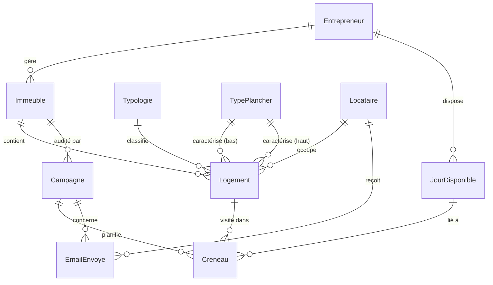
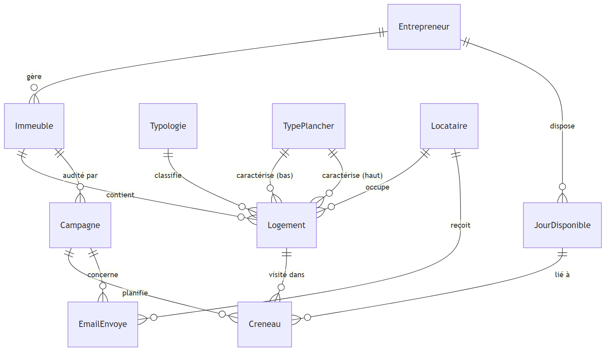
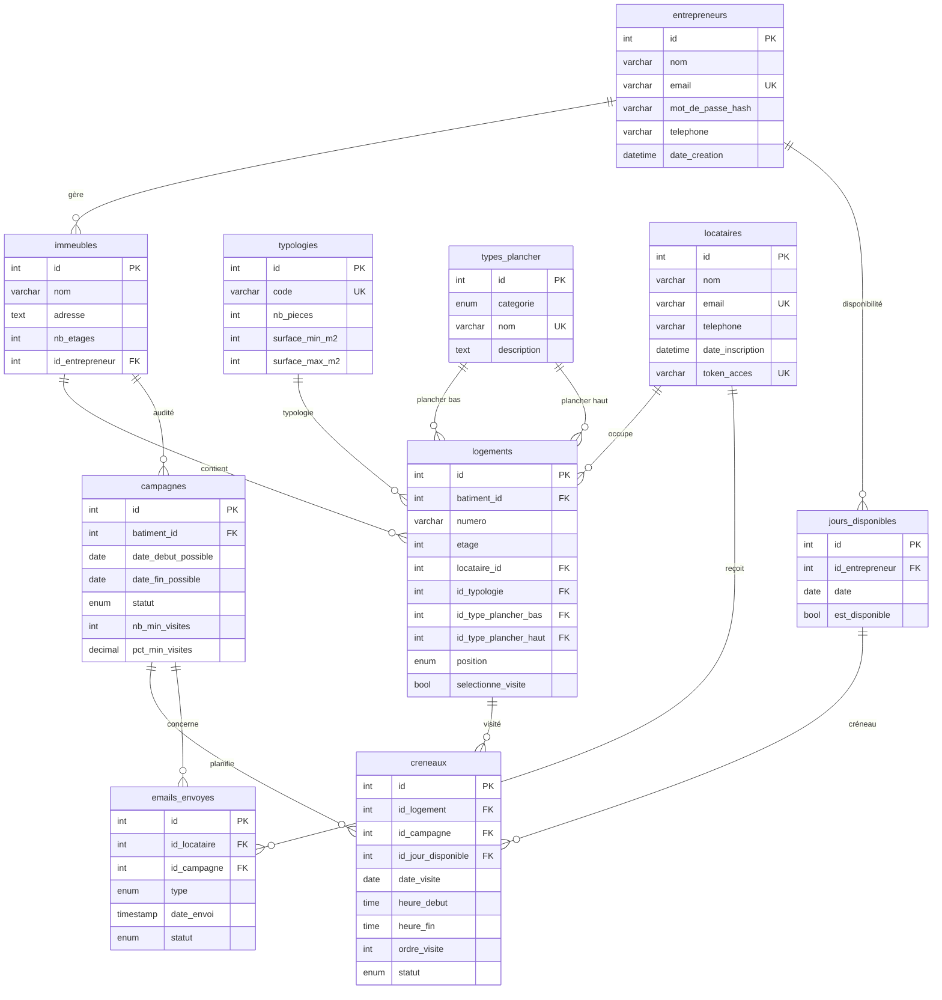

# Documentation de la Base de Données — `audit_energetique`

## Vue d'ensemble

Base de données MySQL pour la gestion d'audits énergétiques : gestion des immeubles, logements, locataires, entrepreneurs, campagnes d'audit, créneaux de visite et notifications par email.

---

---

## Modèle Conceptuel de Données (MCD)

---

## Tables (après migration)

### 1. `locataires` — Locataires

| Colonne | Type | Contraintes |
|---|---|---|
| `id` | INT | `AUTO_INCREMENT`, `PRIMARY KEY` |
| `nom` | VARCHAR(255) | `NOT NULL` |
| `email` | VARCHAR(255) | `NOT NULL`, `UNIQUE` |
| `telephone` | VARCHAR(50) | |
| `date_inscription` | DATETIME | `DEFAULT CURRENT_TIMESTAMP` |
| `token_acces` | VARCHAR(64) | `UNIQUE`, `NULL` |

**Index :** `idx_locataires_token_acces` sur `token_acces`

---

### 2. `entrepreneurs` — Entrepreneurs (diagnostiqueurs)

| Colonne | Type | Contraintes |
|---|---|---|
| `id` | INT | `AUTO_INCREMENT`, `PRIMARY KEY` |
| `nom` | VARCHAR(255) | `NOT NULL` |
| `email` | VARCHAR(255) | `NOT NULL`, `UNIQUE` |
| `mot_de_passe_hash` | VARCHAR(255) | `NOT NULL` |
| `telephone` | VARCHAR(50) | |
| `date_creation` | DATETIME | `DEFAULT CURRENT_TIMESTAMP` |

---

### 3. `immeubles` — Immeubles (ex `batiments`)

| Colonne | Type | Contraintes |
|---|---|---|
| `id` | INT | `AUTO_INCREMENT`, `PRIMARY KEY` |
| `nom` | VARCHAR(255) | `NOT NULL` |
| `adresse` | TEXT | |
| `nb_etages` | INT | `DEFAULT 0` |
| `id_entrepreneur` | INT | `NULL`, `FOREIGN KEY → entrepreneurs(id) ON DELETE SET NULL` |

---

### 4. `typologies` — Typologies de logements (T1, T2, …)

| Colonne | Type | Contraintes |
|---|---|---|
| `id` | INT | `AUTO_INCREMENT`, `PRIMARY KEY` |
| `code` | VARCHAR(3) | `NOT NULL`, `UNIQUE` |
| `nb_pieces` | INT | `NOT NULL`, `CHECK (1–6)` |
| `surface_min_m2` | INT | `NOT NULL` |
| `surface_max_m2` | INT | `NOT NULL` |

---

### 5. `types_plancher` — Types de plancher (bas / haut)

| Colonne | Type | Contraintes |
|---|---|---|
| `id` | INT | `AUTO_INCREMENT`, `PRIMARY KEY` |
| `categorie` | ENUM('bas','haut') | `NOT NULL` |
| `nom` | VARCHAR(50) | `NOT NULL`, `UNIQUE` |
| `description` | TEXT | |

---

### 6. `logements` — Logements (ex `appartements`)

| Colonne | Type | Contraintes |
|---|---|---|
| `id` | INT | `AUTO_INCREMENT`, `PRIMARY KEY` |
| `batiment_id` | INT | `NOT NULL`, `FOREIGN KEY → immeubles(id) ON DELETE CASCADE` |
| `numero` | VARCHAR(50) | `NOT NULL` |
| `etage` | INT | `NOT NULL` |
| `locataire_id` | INT | `FOREIGN KEY → locataires(id) ON DELETE SET NULL` |
| `id_typologie` | INT | `NULL`, `FOREIGN KEY → typologies(id)` |
| `id_type_plancher_bas` | INT | `NULL`, `FOREIGN KEY → types_plancher(id)` |
| `id_type_plancher_haut` | INT | `NULL`, `FOREIGN KEY → types_plancher(id)` |
| `position` | ENUM('rez_de_chaussee','intermediaire','dernier_etage') | `NULL` |
| `selectionne_visite` | BOOLEAN | `DEFAULT FALSE` |

**Contraintes d'unicité :** `UNIQUE(batiment_id, numero)`

**Index :**
- `idx_logements_id_immeuble` sur `batiment_id`
- `idx_logements_id_typologie` sur `id_typologie`

---

### 7. `campagnes` — Campagnes d'audit (ex `campagnes_audit`)

| Colonne | Type | Contraintes |
|---|---|---|
| `id` | INT | `AUTO_INCREMENT`, `PRIMARY KEY` |
| `batiment_id` | INT | `NOT NULL`, `FOREIGN KEY → immeubles(id) ON DELETE CASCADE` |
| `date_debut_possible` | DATE | `NOT NULL` |
| `date_fin_possible` | DATE | `NOT NULL` |
| `statut` | ENUM('ouverte','planification_terminee') | `DEFAULT 'ouverte'` |
| `nb_min_visites` | INT | `DEFAULT 1` |
| `pct_min_visites` | DECIMAL(5,2) | `DEFAULT 50.00` |

---

### 8. `jours_disponibles` — Jours disponibles des entrepreneurs

| Colonne | Type | Contraintes |
|---|---|---|
| `id` | INT | `AUTO_INCREMENT`, `PRIMARY KEY` |
| `id_entrepreneur` | INT | `NOT NULL`, `FOREIGN KEY → entrepreneurs(id) ON DELETE CASCADE` |
| `date` | DATE | `NOT NULL` |
| `est_disponible` | BOOLEAN | `DEFAULT TRUE` |

**Contrainte d'unicité :** `UNIQUE(id_entrepreneur, date)`

---

### 9. `creneaux` — Créneaux de visite (fusion dispo + planning)

| Colonne | Type | Contraintes |
|---|---|---|
| `id` | INT | `AUTO_INCREMENT`, `PRIMARY KEY` |
| `id_logement` | INT | `NOT NULL`, `FOREIGN KEY → logements(id) ON DELETE CASCADE` |
| `id_campagne` | INT | `NOT NULL`, `FOREIGN KEY → campagnes(id) ON DELETE CASCADE` |
| `id_jour_disponible` | INT | `NULL`, `FOREIGN KEY → jours_disponibles(id) ON DELETE SET NULL` |
| `date_visite` | DATE | `NOT NULL` |
| `heure_debut` | TIME | `NOT NULL` |
| `heure_fin` | TIME | `NOT NULL` |
| `ordre_visite` | INT | `NULL` |
| `statut` | ENUM('propose','confirme','effectue','annule') | `DEFAULT 'propose'` |

**Contraintes d'unicité :**
- `UNIQUE(id_campagne, id_logement)` — un seul créneau par logement et campagne
- `UNIQUE(id_campagne, date_visite, heure_debut)` — pas deux visites au même moment

**Index :**
- `idx_creneaux_id_logement` sur `id_logement`
- `idx_creneaux_id_campagne` sur `id_campagne`
- `idx_creneaux_id_jour_disponible` sur `id_jour_disponible`

---

### 10. `emails_envoyes` — Emails envoyés aux locataires

| Colonne | Type | Contraintes |
|---|---|---|
| `id` | INT | `AUTO_INCREMENT`, `PRIMARY KEY` |
| `id_locataire` | INT | `NOT NULL`, `FOREIGN KEY → locataires(id) ON DELETE CASCADE` |
| `id_campagne` | INT | `NOT NULL`, `FOREIGN KEY → campagnes(id) ON DELETE CASCADE` |
| `type` | ENUM('invitation_visite','rappel_visite','non_visite','relance_generique') | `NOT NULL` |
| `date_envoi` | TIMESTAMP | `DEFAULT CURRENT_TIMESTAMP` |
| `statut` | ENUM('envoye','echoue','ouvert','clique') | `DEFAULT 'envoye'` |

**Index :**
- `idx_emails_envoyes_locataire` sur `id_locataire`
- `idx_emails_envoyes_campagne` sur `id_campagne`

---

## Tables supprimées (migration)

| Table | Devenue |
|---|---|
| `batiments` | renommée → `immeubles` |
| `appartements` | renommée → `logements` |
| `campagnes_audit` | renommée → `campagnes` |
| `disponibilites_locataires` | fusionnée dans `creneaux` |
| `plannings_optimises` | fusionnée dans `creneaux` |

---

## Schéma des relations (Mermaid)

